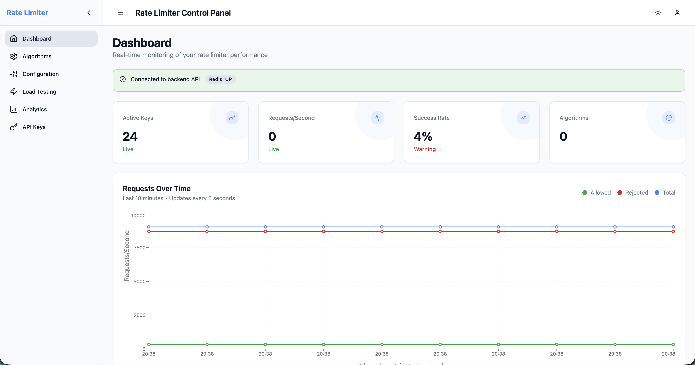
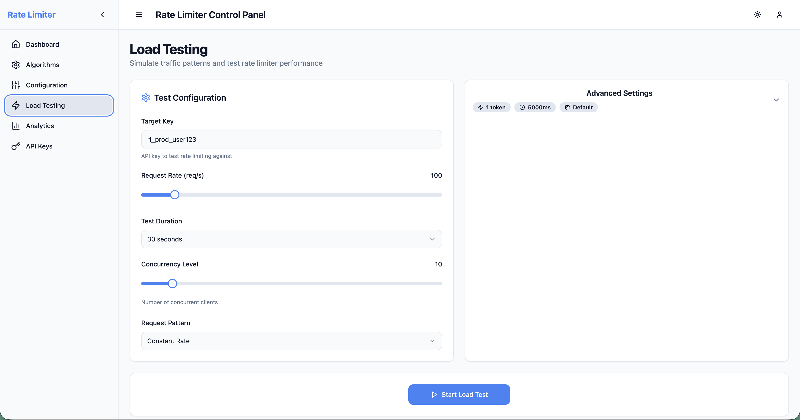
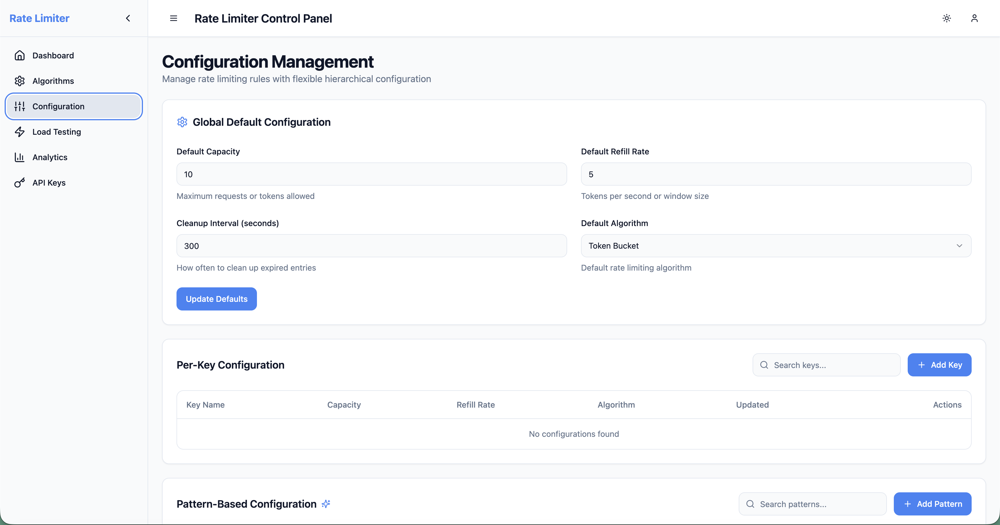

## Overview

A production-ready distributed rate limiter supporting **five algorithms** (Token Bucket, Sliding Window, Fixed Window, Leaky Bucket, and Composite) with Redis backing for high-performance API protection. Perfect for microservices, SaaS platforms, and any application requiring sophisticated rate limiting with algorithm flexibility, multi-dimensional limits, and traffic shaping capabilities.

### Performance Characteristics

| Metric | Value |
|--------|--------|
| **Throughput** | 50,000+ RPS |
| **Latency P95** | <2ms |
| **Memory Usage** | ~200MB baseline + buckets |
| **Redis Ops** | 2-3 per rate limit check |
| **CPU Usage** | <5% at 10K RPS |

---

### Interactive Web Dashboard

A modern, real-time React-based dashboard for monitoring and managing your distributed rate limiter.

**Features:**
- Live metrics with 5-second updates from backend
- Interactive simulation of Token Bucket, Sliding Window, Fixed Window, and Leaky Bucket
- Production-grade benchmarking via backend API
- CRUD operations for global, per-key, and pattern-based limits
- Active keys tracking with statistics and admin controls
- Historical performance trends (demo/preview feature)

**Tech Stack:** React 18 + TypeScript + Vite + Tailwind CSS + shadcn/ui + Recharts

**Quick Start:**
```bash
# Terminal 1: Start backend
./mvnw spring-boot:run

# Terminal 2: Start dashboard
cd examples/web-dashboard
npm install && npm run dev
# Open http://localhost:5173
```

## Dashboard Screenshots

The web dashboard provides a comprehensive interface for monitoring and managing the rate limiter. Below are the key pages:

### Live Monitoring Dashboard


Real-time visualization of rate limiting activity:
- **System Metrics**: Current requests/second, token usage, active keys
- **Algorithm Distribution**: Visual breakdown of Token Bucket, Sliding Window, Fixed Window, Leaky Bucket, Composite usage
- **Recent Activity Feed**: Current per-key snapshot on page load plus live allow/deny updates
- **Trend Charts**: Request rate and token consumption over time

### Load Testing Interface


Execute and analyze load tests against the backend:
- **Test Configuration**: Concurrent requests, duration, key patterns
- **Real-time Progress**: Requests per second, allow/deny rates, and throughput summaries
- **Results Dashboard**: Comprehensive statistics from backend `/api/benchmark/run` endpoint
- **Historical Comparison**: Compare test runs to detect performance regressions

> **Note**: The current benchmark API does not expose response-time percentile data, so the dashboard reports throughput and rate-limit outcomes but marks latency metrics as unavailable.

### Configuration Management


Manage rate limiter configurations dynamically:
- **Key-based Configs**: Per-key limits with exact matching
- **Pattern-based Configs**: Wildcard patterns (e.g., `user:*`, `api:*`)
- **Algorithm Selection**: Switch between Token Bucket, Sliding Window, Fixed Window, Leaky Bucket, Composite
- **Live Updates**: Changes reflected immediately via `/api/ratelimit/config` endpoints

## Installation

### Option 1: Download JAR (Recommended)

```bash
# Download the latest release
wget https://github.com/uppnrise/distributed-rate-limiter/releases/download/v1.4.0/distributed-rate-limiter-1.4.0.jar

# Verify checksum (optional)
wget https://github.com/uppnrise/distributed-rate-limiter/releases/download/v1.4.0/distributed-rate-limiter-1.4.0.jar.sha256
sha256sum -c distributed-rate-limiter-1.4.0.jar.sha256
```

### Option 2: Docker

```bash
# Run the image directly
docker run -p 8080:8080 ghcr.io/uppnrise/distributed-rate-limiter:1.4.0

# Or use the compose file from the repository
curl -O https://raw.githubusercontent.com/uppnrise/distributed-rate-limiter/v1.4.0/docker-compose.yml
docker compose up -d
```

### Option 3: Build from Source

```bash
git clone https://github.com/uppnrise/distributed-rate-limiter.git
cd distributed-rate-limiter
./mvnw clean install
java -jar target/distributed-rate-limiter-1.4.0.jar
```

---

## Quick Start

### Prerequisites

- **Java 21+** (OpenJDK or Oracle JDK)
- **Redis server** (local or remote)
- **2GB RAM minimum** for production usage

### 1. Start the Application

```bash
# Simple startup (embedded configuration)
java -jar distributed-rate-limiter-1.4.0.jar

# With external Redis
java -jar distributed-rate-limiter-1.4.0.jar \
  --spring.data.redis.host=your-redis-server \
  --spring.data.redis.port=6379
```

### 2. Verify Health

```bash
curl http://localhost:8080/actuator/health
```

**Expected Response (default profile):**
```json
{
  "status": "UP"
}
```

When health details are enabled, the same endpoint can also include component-level entries such as `redis` and `rateLimiter`.

### 3. Test Rate Limiting

#### Option A: Using the Web Dashboard (Recommended)

```bash
# Start the backend (if not already running)
java -jar distributed-rate-limiter-1.4.0.jar

# In a new terminal, start the dashboard
cd examples/web-dashboard
npm install && npm run dev
# Dashboard available at http://localhost:5173
```
#### Option B: Using cURL

```bash
# Check rate limit for a key
curl -X POST http://localhost:8080/api/ratelimit/check \
  -H "Content-Type: application/json" \
  -d '{"key": "user:123", "tokens": 1}'
```

**Response:**
```json
{
  "allowed": true,
  "remainingTokens": 9,
  "resetTimeSeconds": 1694532000,
  "retryAfterSeconds": null
}
```

## Architecture

### System Architecture

```
┌─────────────────┐    ┌─────────────────┐    ┌─────────────────┐
│   Client App    │───▶│  Rate Limiter   │───▶│     Redis       │
│                 │    │   (Port 8080)   │    │   (Distributed  │
│                 │    │                 │    │     State)      │
└─────────────────┘    └─────────────────┘    └─────────────────┘
                                │
                                ▼
                       ┌─────────────────┐
                       │   Monitoring    │
                       │   & Metrics     │
                       │  (Prometheus)   │
                       └─────────────────┘
```

### Rate Limiting Algorithms

The rate limiter supports five different algorithms optimized for different use cases:

#### Token Bucket (Default)
- **Best for**: APIs requiring burst handling with smooth long-term rates
- **Characteristics**: Allows bursts up to capacity, gradual token refill
- **Use cases**: General API rate limiting, user-facing applications

#### Sliding Window
- **Best for**: Consistent rate enforcement with precise timing
- **Characteristics**: Tracks requests within a sliding time window
- **Use cases**: Critical APIs requiring strict rate adherence

#### Fixed Window  
- **Best for**: Memory-efficient rate limiting with predictable resets
- **Characteristics**: Counter resets at fixed intervals, low memory usage
- **Use cases**: High-scale scenarios, simple rate limiting needs

#### Leaky Bucket
- **Best for**: Traffic shaping and consistent output rates
- **Characteristics**: Queue-based processing at constant rate, no bursts allowed
- **Use cases**: Downstream service protection, SLA compliance, network-like behavior

#### Composite (**NEW**)
- **Best for**: Enterprise scenarios requiring multiple simultaneous limits
- **Characteristics**: Combines multiple algorithms with configurable combination logic
- **Use cases**: SaaS platforms (API + bandwidth + compliance), Financial systems (rate + volume + velocity), Multi-tenant hierarchical limits
- **Combination Logic**: ALL_MUST_PASS, ANY_CAN_PASS, WEIGHTED_AVERAGE, HIERARCHICAL_AND, PRIORITY_BASED

**Algorithm Selection**: Configure per key pattern or use runtime configuration to select the optimal algorithm for each use case.

---

## Configuration

### Basic Configuration

The rate limiter supports hierarchical configuration:

1. **Per-key configuration** (highest priority)
2. **Pattern-based configuration** (e.g., `user:*`, `api:v1:*`)
3. **Default configuration** (fallback)

### Application Properties

```properties
# Redis Configuration
spring.data.redis.host=localhost
spring.data.redis.port=6379
spring.data.redis.password=
spring.data.redis.database=0

# Rate Limiter Defaults
ratelimiter.capacity=10
ratelimiter.refillRate=2
ratelimiter.cleanupIntervalMs=60000

# Performance Tuning
spring.data.redis.lettuce.pool.max-active=20
spring.data.redis.lettuce.pool.max-idle=10
spring.data.redis.lettuce.pool.min-idle=5

# Server Configuration
server.port=8080
management.endpoints.web.exposure.include=health,metrics,info
```

### Environment Variables

```bash
# Production deployment
export SPRING_DATA_REDIS_HOST=redis.production.com
export SPRING_DATA_REDIS_PASSWORD=your-redis-password
export RATELIMITER_CAPACITY=100
export RATELIMITER_REFILL_RATE=50
export SERVER_PORT=8080
```

### CORS Configuration

Frontend origins are now configured centrally through application properties or environment variables instead of controller annotations.

```properties
ratelimiter.cors.allowed-origins=https://app.example.com,https://admin.example.com
ratelimiter.cors.allowed-origin-patterns=https://*.internal.example.com
ratelimiter.cors.allowed-methods=GET,POST,PUT,DELETE,OPTIONS,PATCH
ratelimiter.cors.allow-credentials=true
```

```bash
export RATELIMITER_CORS_ALLOWED_ORIGINS=https://app.example.com,https://admin.example.com
export RATELIMITER_CORS_ALLOWED_ORIGIN_PATTERNS=https://*.internal.example.com
```

### Dynamic Configuration

Update configuration at runtime via REST API:

```bash
# Update default limits
curl -X POST http://localhost:8080/api/ratelimit/config/default \
  -H "Content-Type: application/json" \
  -d '{"capacity":20,"refillRate":5}'

# Set limits for specific keys
curl -X POST http://localhost:8080/api/ratelimit/config/keys/vip_user \
  -H "Content-Type: application/json" \
  -d '{"capacity":200,"refillRate":50}'
```

---

## API Endpoints

The application provides a comprehensive REST API with the following endpoints:

### Rate Limiting Operations
- `POST /api/ratelimit/check` - Check if request is allowed for a key
- `GET /api/ratelimit/config` - Get current rate limiter configuration
- `POST /api/ratelimit/config/default` - Update default configuration
- `POST /api/ratelimit/config/keys/{key}` - Set configuration for specific key
- `POST /api/ratelimit/config/patterns/{pattern}` - Set configuration for key pattern
- `DELETE /api/ratelimit/config/keys/{key}` - Remove key-specific configuration
- `DELETE /api/ratelimit/config/patterns/{pattern}` - Remove pattern configuration
- `POST /api/ratelimit/config/reload` - Reload configuration and clear caches
- `GET /api/ratelimit/config/stats` - Get configuration statistics

### Administrative Operations
- `GET /admin/keys` - List all active rate limiting keys with statistics
- `GET /admin/limits/{key}` - Get current limits for a specific key
- `PUT /admin/limits/{key}` - Update limits for a specific key
- `DELETE /admin/limits/{key}` - Remove limits for a specific key

### Performance Monitoring
- `POST /api/performance/baseline` - Store performance baseline
- `POST /api/performance/regression/analyze` - Analyze performance regression
- `POST /api/performance/baseline/store-and-analyze` - Store baseline and analyze
- `GET /api/performance/baseline/{testName}` - Get historical baselines
- `GET /api/performance/trend/{testName}` - Get performance trend data
- `GET /api/performance/health` - Performance monitoring health check

### Benchmarking
- `POST /api/benchmark/run` - Run performance benchmark
- `GET /api/benchmark/health` - Benchmark service health check

### Metrics and Monitoring
- `GET /metrics` - Get system metrics
- `GET /actuator/health` - Application health status
- `GET /actuator/metrics` - Detailed application metrics
- `GET /actuator/prometheus` - Prometheus-compatible metrics

### API Documentation
- `GET /swagger-ui/index.html` - Interactive API documentation
- `GET /v3/api-docs` - OpenAPI specification (JSON)

---

## Monitoring & Observability

### Built-in Metrics

The application exposes comprehensive metrics via `/metrics` endpoint:

```bash
# Key performance indicators
curl http://localhost:8080/metrics | grep rate_limit

# Example metrics:
rate_limit_requests_total{key="user:123",result="allowed"} 1250
rate_limit_requests_total{key="user:123",result="denied"} 15
rate_limit_response_time_seconds{quantile="0.95"} 0.002
rate_limit_active_buckets_total 5420
```

### Health Checks

```bash
# Detailed health information
curl http://localhost:8080/actuator/health/rateLimiter

# Response includes:
# - Redis connectivity status
# - Active bucket count
# - Performance metrics
# - System resource usage
```

### Key Metrics

- `rate.limiter.requests.total` - Total rate limit checks
- `rate.limiter.requests.allowed` - Allowed requests
- `rate.limiter.requests.denied` - Denied requests
- `redis.connection.pool.active` - Active Redis connections

---

## Security

### API Key Authentication

```bash
curl -X POST http://localhost:8080/api/ratelimit/check \
  -H "Content-Type: application/json" \
  -d '{
    "key": "user:123",
    "tokens": 1,
    "apiKey": "your-api-key"
  }'
```

### IP Address Filtering

Configure IP whitelist/blacklist in `application.properties`:

```properties
ratelimiter.security.ip.whitelist=192.168.1.0/24,10.0.0.0/8
ratelimiter.security.ip.blacklist=192.168.1.100
```

---

## Production Deployment

### Docker Environment

```yaml
# docker-compose.yml
version: '3.8'
services:
  rate-limiter:
    image: ghcr.io/uppnrise/distributed-rate-limiter:1.4.0
    ports:
      - "8080:8080"
    environment:
      - SPRING_DATA_REDIS_HOST=redis
      - RATELIMITER_DEFAULT_CAPACITY=100
    depends_on:
      - redis
      
  redis:
    image: redis:8-alpine
    ports:
      - "6379:6379"
```

### Kubernetes Deployment

```yaml
# k8s-deployment.yaml
apiVersion: apps/v1
kind: Deployment
metadata:
  name: rate-limiter
spec:
  replicas: 3
  selector:
    matchLabels:
      app: rate-limiter
  template:
    metadata:
      labels:
        app: rate-limiter
    spec:
      containers:
      - name: rate-limiter
        image: ghcr.io/uppnrise/distributed-rate-limiter:1.4.0
        ports:
        - containerPort: 8080
        env:
        - name: SPRING_DATA_REDIS_HOST
          value: "redis-service"
        resources:
          requests:
            memory: "512Mi"
            cpu: "250m"
          limits:
            memory: "1Gi"
            cpu: "500m"
        livenessProbe:
          httpGet:
            path: /actuator/health
            port: 8080
          initialDelaySeconds: 30
          periodSeconds: 10
```

### Performance Recommendations

- **Memory**: Allocate 512MB-1GB depending on bucket count
- **CPU**: 1-2 cores recommended for high-throughput scenarios
- **Redis**: Use dedicated Redis instance with persistence enabled
- **Load Balancing**: Multiple instances share state via Redis
- **Monitoring**: Set up alerts for P95 latency >5ms and error rate >1%

---

## Performance Benchmarks

### Throughput Benchmarks

| Scenario | RPS | Latency P95 | CPU Usage | Memory Usage |
|----------|-----|-------------|-----------|--------------|
| Single Key | 52,000 | 1.8ms | 45% | 250MB |
| 1K Keys | 48,000 | 2.1ms | 52% | 380MB |
| 10K Keys | 45,000 | 2.8ms | 58% | 650MB |
| 100K Keys | 40,000 | 3.2ms | 65% | 1.2GB |

### Scaling Characteristics

- **Horizontal Scaling**: Linear scaling with Redis cluster
- **Memory Usage**: ~8KB per active bucket
- **Redis Operations**: 2-3 operations per rate limit check
- **Network Overhead**: <1KB per request/response

---
